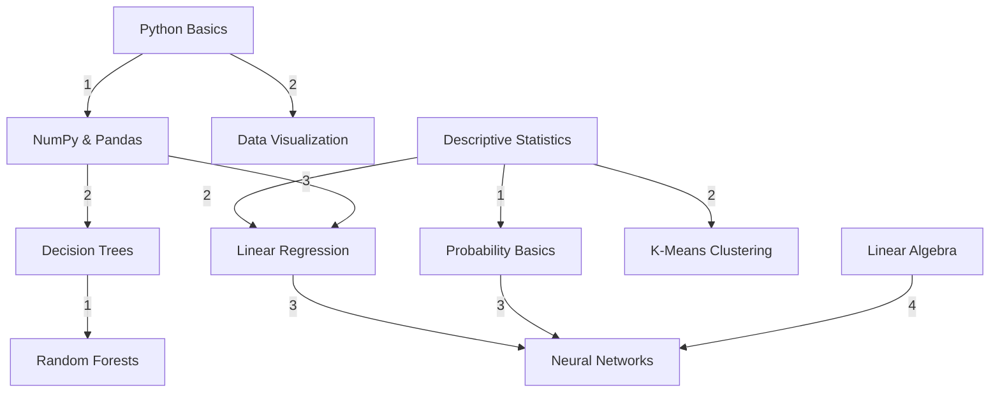
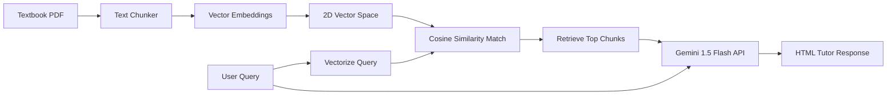

# AetherLearn: Personalized AI Learning & DSA Path Optimizer

AetherLearn is a state-of-the-art, interactive Single Page Web Application (SPA) designed to combine **Data Structures & Algorithms (DSA)** pathing, **Client-Side Machine Learning**, **Retrieval-Augmented Generation (RAG)** vector space simulations, and **Conversational AI Coaching** into a visually stunning, glassmorphic student dashboard.

Designed for static hosting (e.g. GitHub Pages), this project runs completely in the web browser, eliminating complex backend configurations and enabling recruiters to test all features instantly.

---

## 🚀 Live Demo
🌐 **Deployment URL:** [https://niraj987.github.io/aetherlearn/](https://niraj987.github.io/aetherlearn/)

---

## 🛠️ Tech Stack & Key APIs
- **Frontend Core:** HTML5 (Semantic Structure) & ES6 Javascript (Logic & Custom Algorithms)
- **Styling System:** Vanilla CSS3 (Custom properties, dark mode, glassmorphism, responsive grid, visual canvas wrappers)
- **Visual Engines:** HTML5 Canvas (Graph visualizations & 2D Vector projections)
- **AI Integrations:** Live **Gemini 1.5 Flash API** (`generateContent` endpoint via fetch)
- **Voice Capabilities:** Web Speech API (SpeechSynthesis for text readings & SpeechRecognition for mic transcriptions)

---

## 🌿 Core Architecture & Modules

### 1. Curriculum Organizer (DSA Graph & Tree)
Visualizes how classic algorithms map directly to learning schedules and subject mappings.
- **Tree Hierarchy:** Stores subject categories and topics recursively.
- **Dependency Graph:** Models prerequisites as directed weighted edges.
- **Step-by-Step Visualization:** Runs BFS, DFS, Dijkstra (shortest route to a target subject), and Topological Sort (optimal learning sequence), animating nodes and log updates on a custom canvas.



---

### 2. Live Performance Predictor (Client-Side ML)
Features a fully functional multivariate prediction system built entirely in Vanilla JS.
- **Multivariate Linear Regression:** Predicts exam outcomes using study parameters. Trains live in-browser using **Gradient Descent**, displaying real-time Mean Squared Error (MSE) convergence logs.
- **Decision Tree Classifier:** Categorizes academic outcomes (Pass/Fail) by executing a Gini Impurity split model.
- **Adaptive Recommendations:** Recalibrates study warnings and Netflix-style path recommendations dynamically as parameters update.

```
Score = w0 + w1*(Attendance) + w2*(StudyHours) + w3*(PrevGPA) + w4*(QuizScore) - w5*(Difficulty)
```

---

### 3. AI Tutor & Vector RAG Pipeline
Simulates a Retrieval-Augmented Generation context system directly in JavaScript.
- **Document Chunker:** Splits curriculum textbooks into logical sentence chunks.
- **Embedding Generator:** Creates vector profiles for chunks based on vocabulary term-frequency.
- **Vector DB Store:** Projects chunks onto a 2D canvas grid and performs **Cosine Similarity** search matches.
- **Prompt Formulator:** Couples matched segments with query inputs, executing live calls to the **Gemini 1.5 Flash API** or triggering offline simulated fallbacks.



---

### 4. Interactive Quiz & Summarizer
- **Automated Summarizer:** Paste text notes to extract key sentences and compile **flipped revision cards**.
- **Quiz Generator:** Renders topic assessments containing MCQ, True/False, and fill-in-the-blank items. Connects quiz completions to XP leveling, streak metrics, and ML predictors.

---

## ⚙️ Local Setup Instructions

No complex server setup is required. To launch locally:

### Option A: Node.js (Recommended)
1. Ensure Node.js is installed.
2. In the project directory, launch a lightweight static server:
   ```bash
   node -e "const http = require('http'), fs = require('fs'), path = require('path'); http.createServer((req, res) => { let fp = path.join('.', req.url === '/' ? 'index.html' : req.url); fs.readFile(fp, (err, content) => { if(err) { res.statusCode = 404; res.end('Not Found'); } else { res.end(content); } }); }).listen(8000);"
   ```
3. Open `http://localhost:8000` in your web browser.

### Option B: Python
1. In the project root folder, execute:
   ```bash
   python -m http.server 8000
   ```
2. Open `http://localhost:8000` in your web browser.

---

## 🛡️ License
This project is licensed under the MIT License - see the [LICENSE](LICENSE) file for details.
